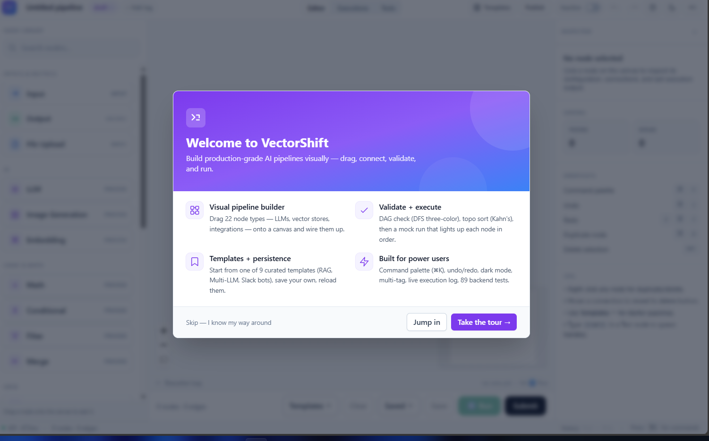
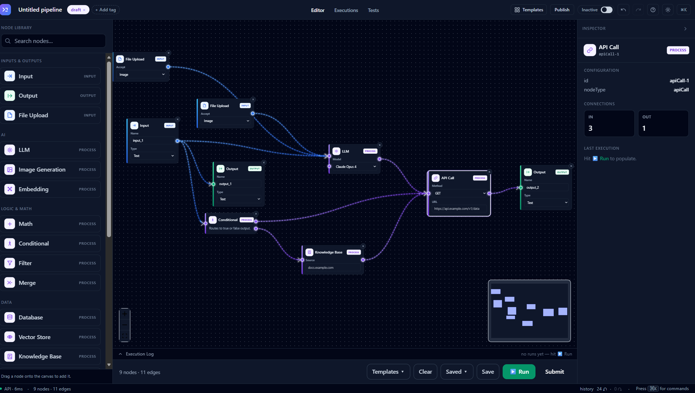

# 🏗️ CONSTRUCT ASK
**Construction Project Intelligence & Compliance Platform**



Construct Ask is an enterprise-grade compliance and supply-chain intelligence platform built for modern construction projects. It replaces manual paperwork and scattered emails with Cryptographically Verifiable Digital Product Passports (DPP), providing a tamper-proof, real-time single source of truth for materials from the factory floor to final installation.



## ✨ Key Features
- **🔒 Cryptographically Verifiable DPPs:** Every material gets a Digital Product Passport signed with Ed25519 keys. Physical QR codes link directly to these immutable records.
- **🔗 Hash-Chained Audit Trails:** All state changes (manufacturing, certification, delivery, installation, auditing) are cryptographically chained. If one record is altered, the entire chain invalidates—ensuring total data integrity.
- **📱 Field-Ready QR Scanning:** Site engineers can instantly verify materials on-site using the built-in scanner, checking compliance, expiration dates, and installation readiness.
- **🤖 AI Evidence Assistant:** Integrated with Gemini/OpenAI to answer complex compliance queries, summarize supplier health, and predict project risks based on real-time data.
- **📊 Project Intelligence Dashboard:** High-level views of supplier reliability, delayed deliveries, expiring certificates, and critical path blockers.
- **📑 Automated Enterprise Reporting:** Generate comprehensive, styled PDF reports of compliance matrices and audit logs using ReportLab.

## 🛠️ Technology Stack
| Category | Technology | Purpose |
| :--- | :--- | :--- |
| Core Framework | FastAPI, Python 3.11 | High-performance async REST API. |
| Frontend | React 19, TypeScript, Vite | Lightning-fast SPA with modern UI/UX. |
| Styling & UI | Tailwind CSS v4, Framer Motion | Premium micro-animations and responsive design. |
| Database | SQLite / PostgreSQL | State persistence and relational data mapping. |
| Cryptography | Ed25519, SHA-256 | DPP signatures and immutable hash-chained audit ledgers. |
| Generative AI | Google Gemini / OpenAI | Evidence compliance parsing and risk analysis. |
| Reporting | ReportLab | Enterprise PDF compliance matrix generation. |

## 🏗️ System Architecture

## 🚀 Getting Started (Local Development)

### 1. Clone the repository
```bash
git clone https://github.com/superstove/CONSTRUCTASK.git
cd constructask
```

### 2. Backend Setup
```bash
cd backend

# Create a virtual environment and activate it
python -m venv venv
source venv/bin/activate  # On Windows: venv\Scripts\activate

# Install dependencies
pip install -r requirements.txt

# Set up environment variables
cp .env.example .env
# Edit .env and add your GEMINI_API_KEY if you want AI features

# Start the FastAPI server
uvicorn main:app --reload
```
The API will be available at `http://localhost:8000` (Docs at `http://localhost:8000/docs`).

### 3. Frontend Setup
Open a new terminal window:
```bash
cd frontend

# Install dependencies
npm install

# Start the Vite development server
npm run dev
```
The application will be available at `http://localhost:5173`.

## 🤝 Architecture Notes
This project was built with a strong focus on data integrity and premium UI/UX. The cryptographic chaining mechanism ensures that once a material is marked as "Failed QA" or "Installed", that record cannot be retroactively edited without breaking the verification hash, providing true accountability in construction supply chains.

Engineered by Abhijith AK for Anton Solutions.
